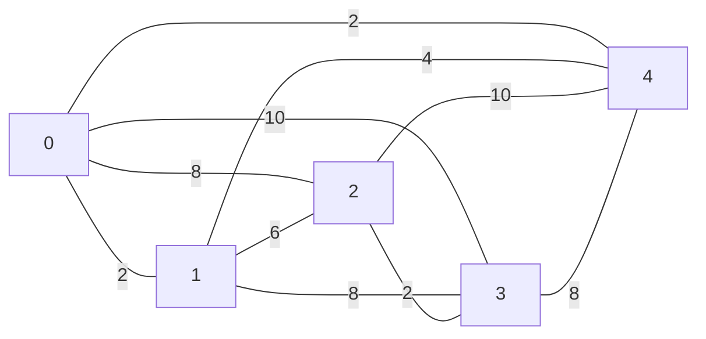

# Day 24: Air Duct Spelunking

[Problem Link](https://adventofcode.com/2016/day/24)

## Computing the Distance Graph

The trick to this problem is to understand how to compress the information given to us. We have a very large `map` but only a hand-full of locations that we have to hit. In other words, the state-space is **sparse**. So what we want to do is to convert this into a smaller **distance graph**. For example, on the input

```
###########
#0.1.....2#
#.#######.#
#4.......3#
###########
```

the corresponding distance graph is



Note that the distance graph is a [complete graph](https://en.wikipedia.org/wiki/Complete_graph).

This is a much more compact object to work with. In the example input, this distance graph has 5 nodes and in the actual input it has 8. So the most computationally intensive part of our algorithm is just computing this graph.

You could do this using [Breadth-First Search](https://en.wikipedia.org/wiki/Breadth-first_search) (BFS) and essentially doing a whole state-space search. However, this is far too slow has the state-space is large. Instead, since the state-space is sparse, calling [A*](https://en.wikipedia.org/wiki/A*_search_algorithm) on each pair of nodes is much more efficient. I used the [Taxicab distance](https://en.wikipedia.org/wiki/Taxicab_geometry) as the **admissible heuristic**.

## Part 1

Part 1 is asking us to find the minimum [Hamiltonian path](https://en.wikipedia.org/wiki/Hamiltonian_path) starting at location `0`. Using the distance graph, we can iterate over **all permutations of target locations**, which gives
```
ham_path = [start] + target_perm
```

The solution is the path of this kind with the minimum weight.

Note that finding the minimum Hamiltonian path is [NP-Complete](https://en.wikipedia.org/wiki/NP-completeness), so there is not a more efficient algorithm than just brute force (from a theoretical perspective).

## Part 2 

Part 1 is asking us to find the minimum [Hamiltonian cycle](https://www.geeksforgeeks.org/dsa/hamiltonian-cycle/). Using the distance graph, we can iterate over **all permutations of target locations**, which gives
```
ham_cycle = [start] + target_perm + [start]
```

The solution is the cycle of this kind with the minimum weight.

Note that finding the minimum Hamiltonian cycle is [NP-Complete](https://en.wikipedia.org/wiki/NP-completeness), so there is not a more efficient algorithm than just brute force (from a theoretical perspective).