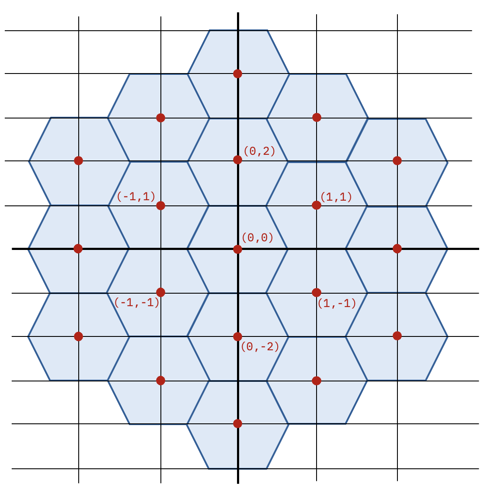
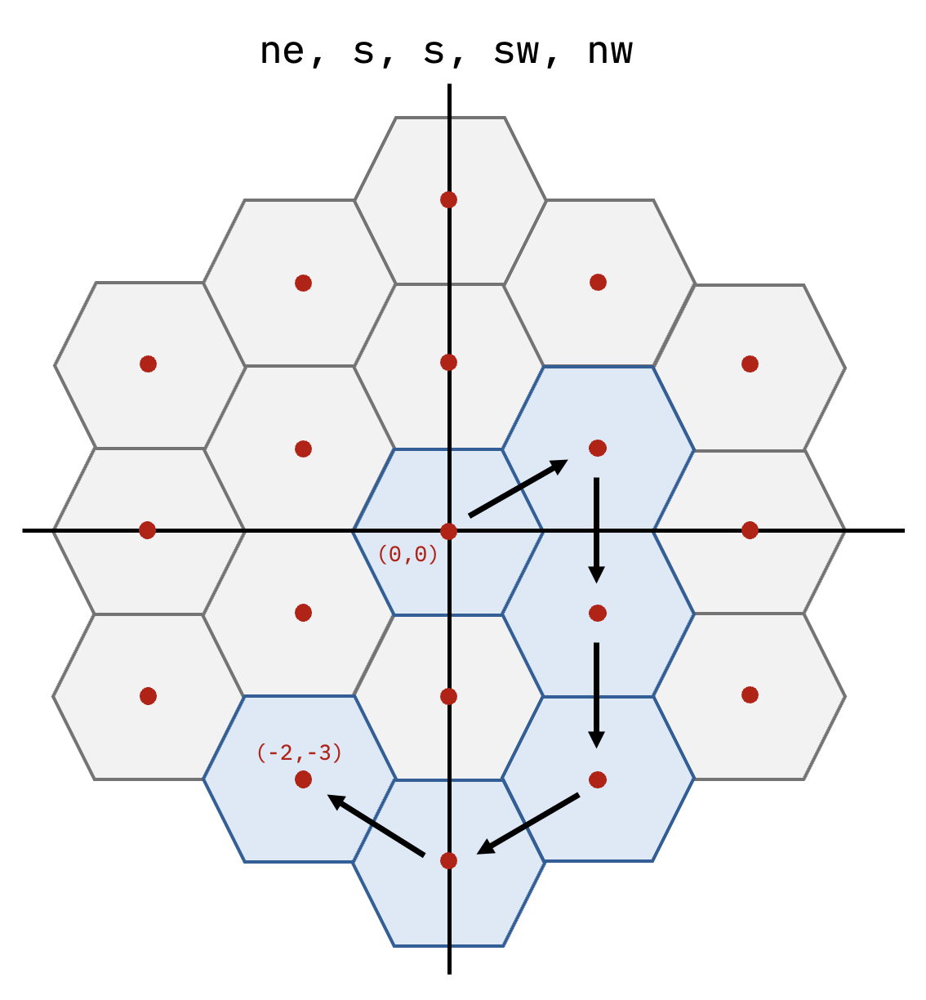
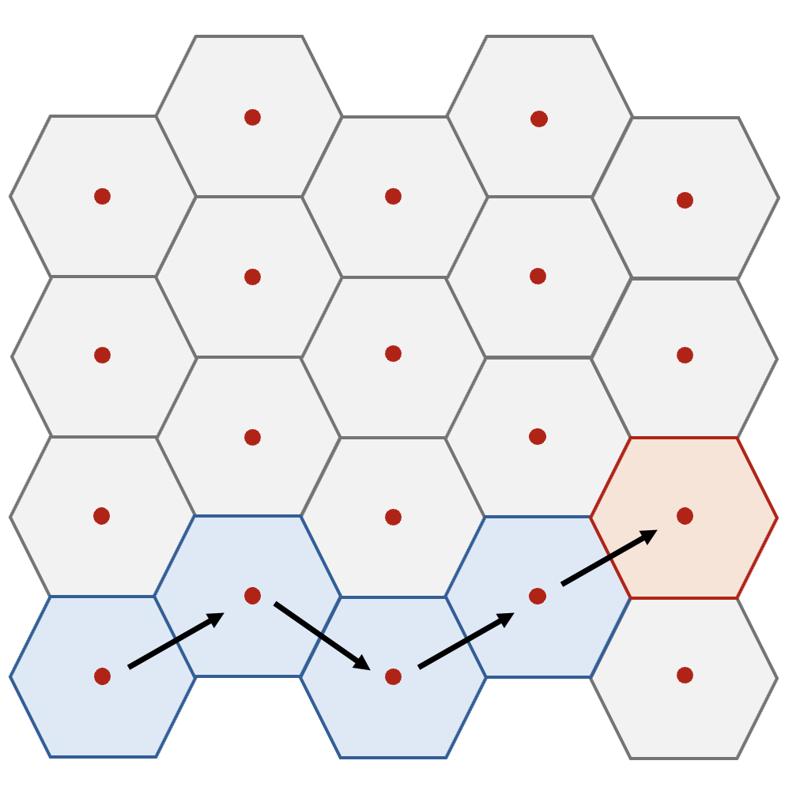
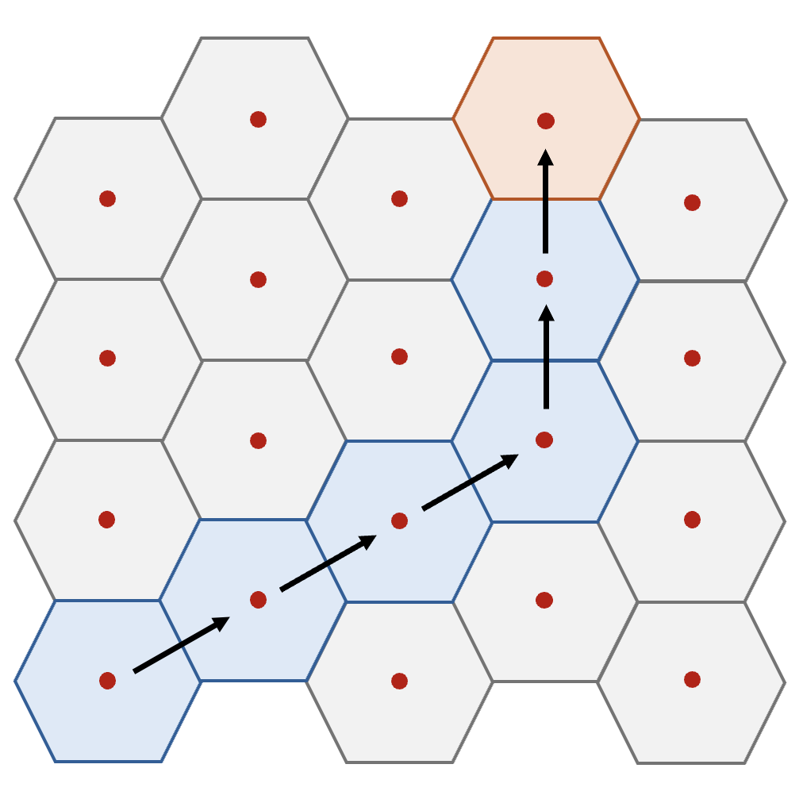

# Day 11: Hex Ed

[Problem Link](https://adventofcode.com/2017/day/11)

## Part 1 and Part 2

I really like this problem. It has very nice geometry

### The Hexagonal Grid

The first trick is we need to map these hexagonal movements onto a typical Cartesian grid. Consider the following



So, each direction maps to a horizontal/vertical displacement on the typical Cartesian grid.

```python
displacement_map = {
    "n": (0, 2),
    "ne": (1, 1),
    "se": (1, -1),
    "s": (0, -2),
    "sw": (-1, -1),
    "nw": (-1, 1)
}
```

Notice now, that `ne + nw == n`, These directions work exactly how you would expect them to, and that can be seen visually by the grid above.

Another interesting thing to note is there are impossible coordinates to reach. For example, `(0, 1)` can never be reached. So this hexagonal grid is a [normal subgroup](https://en.wikipedia.org/wiki/Normal_subgroup) of the Cartesian grid, i.e. it's self-contained. Pretty neat!

### Determining the Final Cartesian Position

Now, given a sequence of hexagon moves, we can determine the final position in our Cartesian coordinate system.

For each hex step, we sum the Cartesian displacements in `displacement_map`. Here is an example.



This is implemented in `update_hex_position()`.

### Finding the Optimal Number of Steps

Now the problem has reduced to _what is the minimum number of hexagon steps required to get to a given coordinate_. This what is implemented in `get_hex_distance()`.

First, we notice that the problem is symmetric. Without loss of generality, we can assume the target coordinates are in the northeast quadrant. This is the purpose of the line
```python
x, y = abs(x), abs(y)
```

There are 2 cases. **Case 1** is when `y <= x`. In this case, we never need to use the north direction. An optimal solution can be reached with the correct zig-zag of northeast and southeast steps. For example



Therefore, for case 1, the optimal number of steps is just equal to `x`.

**Case 2** is when `y > x`. Here, an optimal solution is to just two "straight" lines. First, we use only northeast steps until we are directly below the target. Then, we use only north steps to reach the final target coordinate.



Therefore, for case 2, the optimal number of steps is
```
(number of northeast steps) + (number of north steps)
= (x) + ((y-x)//2)
```

We divide by `2` because each north step is 2 units in the grid, but only 1 hexagon step.

Both cases can be expressed as a single formula
```python
def get_hex_distance(x, y):
    x, y = abs(x), abs(y)
    return x + max(y - x, 0) // 2
```


## The Integer Programming Solution

We can formalize our argument above using [Integer Programming](https://en.wikipedia.org/wiki/Integer_programming).

Once we've confined the problem to the northeast quadrant, an optimal path will contain some combination of the following directions
```
n : (0, 2)
ne: (1, 1)
nw: (1, -1)
```

If we have a final position $(x, y)$, then we want to find coefficients $a, b, c \geq 0$ such that

$$
a \begin{bmatrix}
0 \\
2 
\end{bmatrix}
+
b \begin{bmatrix}
1 \\
1 
\end{bmatrix}
+
c \begin{bmatrix}
1 \\
-1 
\end{bmatrix} = \begin{bmatrix}
x \\
y 
\end{bmatrix}
$$

and we want to find the minimum such coefficients. In full, the optimization problem can be stated as follows.

$$
\min_{a, b, c \geq 0} \{a + b + c\}
\qquad\text{s.t.}\qquad
\begin{bmatrix}
0 & 1 & 1 \\
2 & 1 & -1 
\end{bmatrix}
\begin{bmatrix}
a \\
b \\
c 
\end{bmatrix}
= \begin{bmatrix}
x \\
y
\end{bmatrix}
$$

We could have put this into an integer programming solver to arrive at the same answer, but it turned out we had a greedy approach.

Recall that in case 1, we never needed a north direction. Therefore $a = 0$ and $b, c$ are now determined since we have 2 equations and 2 unknowns. Likewise in case 2, we never needed southeast and therefore $c = 0$. Again, now $a, b$ are determined as we have 2 equations and 2 unknowns. Therefore, the full solution is the following

$$
\boxed{
(a^*, b^*, c^*) = \begin{cases}
    (0, \ \tfrac{x+y}{2}, \ \frac{x-y}{2}) &\quad\text{if } x \geq y \\
    (\tfrac{y-x}{2}, \ x, \ 0) &\quad\text{if } x < y
\end{cases}
}
$$

Therefore, the optimal number of steps is
$$
\boxed{
\text{steps}^* = \begin{cases}
    x &\quad\text{if } x \geq y \\
    \tfrac{x+y}{2} &\quad\text{if } x < y
\end{cases}
}
$$