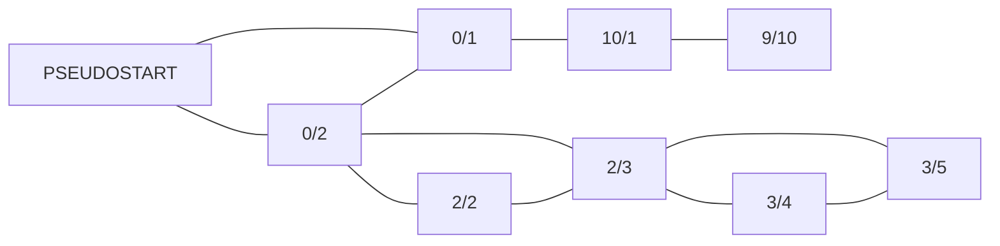

# Day 24: Electromagnetic Moat

[Problem Link](https://adventofcode.com/2017/day/24)

## Part 1

A very fun graph algorithm problem. I first construct a graph where the nodes are the **components** given by the problem. An edge exists between two components if and only if the components could be connected, i.e. one of the ports have equal pins. For example, the example input
```
0/2, 2/2, 2/3, 3/4, 3/5, 0/1, 10/1, 9/10
```

becomes



Notice that I've added a `PSEUDOSTART` which connects to all components with a `0` pin. This makes the graph traversal easier. The construction of this graph is written in the function `construct_graph()` in `part_1.py`.

Now, we just have to use a modified [Depth-First Search](https://en.wikipedia.org/wiki/Depth-first_search) to find **all simple paths** starting at the pseudo-start. 

There is one important detail when writing this DFS. Let's use an example to explain. Suppose you are at node `0/2` via the `PSEUDOSTART`. There is an edge to `0/2 --- 0/1` however we should not use it. We have already used the `0` port in `0/2`, so that is no longer available to connect to `0/1`. Ultimately this is because our edges are ambiguous.

There are two ways to solve this. First is you could create a much more complicated graph, where each node becomes two nodes (one for each port). But this leads to many complications. The second and easier way is to just maintain the **open port** during the traversal. When iterating over neighbors, just check if the neighbor has a matching port. This is the purpose of the line

```python
p1, p2 = components[neighbor]
if open_pin != p1 and open_pin != p2:
    continue
```

The details of this algorithm are implemented in `get_all_paths()`. Now we have a list of all possible bridges, and we just take the one with the maximum _strength_.

## Part 2 

Part 2 is exactly the same, except we take the bridge with the maximum length, breaking ties by strength.