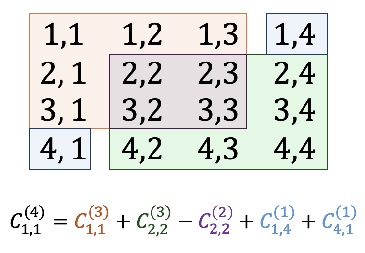

# Day 11: Chronal Charge

[Problem Link](https://adventofcode.com/2018/day/11)

## Part 1

I'll break this explanation up into steps. There is a lot going on but none of it is complicated. Note that I chose to implement these solutions using native Python lists, rather than using numpy. I'm not sure why, I just felt like doing it the hard way.

### Computing the Power Level of Each Fuel Cell

The logic of determining the power level of each fuel cell is implemented in `get_power_level()` in `part_1.py`. This is just an implementing the instructions of the problem. This produces a `(300, 300)` array with pseudo-random values, which I denote `power_levels`. 

### 2D Convolution

The problem asks us to sum every `(3, 3)` box inside of the `power_levels` array. The generalization of this operation is called a (Convolution)[TODO]. Suppose $A \in \mathbb{Z}^{m \times n}$ is the input array and $K \in \mathbb{Z}^{\ell \times k}$ is the kernel. Then the convolution produces an output $C \in \mathbb{Z}^{(m-\ell) \times (n - k)}$ such that

$$
C_{x, y} = \sum_{i=0}^{\ell} \sum_{j=0}^{k} K_{i, j} \cdot A_{x+i, y+j}
$$


There are libraries which efficiently compute a 2D convolution such as **scipy TOOD**. However, I implemented this logic by hand in the function `convolution_2d()` in `part_1.py`. 

To solve this particular problem, I create the kernel
$$
K = \begin{bmatrix}
1 & 1 & 1 \\
1 & 1 & 1 \\
1 & 1 & 1
\end{bmatrix}
$$

and convolve this with the `power_levels` array. Notice that this will result in summing all values in each `(3, 3)` box inside of the `power_levels` array.

### Maximizing

The result is an array of size `(300 - 3, 300 - 3) = (297, 297)` where each value is the sum of the corresponding `(3, 3)` box inside of the `power_levels` array. The solution asks for the indices of the maximum values. 


Note that fuel cells index at `1`, hence the line

```python
return max_x+1, max_y+1
```

## Part 2 

### The Brute Force Solution

We essentially repeat part 1, except instead of only considering a kernel size of `(3, 3)` we loop over all kernel sizes `(k, k)` for `k = 1, ..., 300`. This is implemented in `brute_force()` in `part_2.py`. However, this approach is too slow. We can do much better.

### The Efficient Solution

The issue with the brute force approach is it does **a lot** of repeated computation. The key to solving this efficiently is to reuse past results. To explain this, I need a bit of formalism.

- Let $P \in \mathbb{Z}^{n \times n}$ be the `power_levels` array
- Let $C^{(k)} \in \mathbb{Z}^{(n - k) \times (n - k)}$ be the convolution of $P$ with kernel size $k \times k$
- Therefore, $C^{(1)} = P$

Suppose I have computed $C^{(\ell)}$ for all $\ell = 1, \ldots, k$ and I wish to compute $C^{(k+1)}$. Then I claim the following

$$
C^{(k+1)}_{x, y} = C^{(k)}_{x, y} + C^{(k)}_{x+1, y+1} - C^{(k-1)}_{x+1, y+1} + C^{(1)}_{x+k, y} + C^{(1)}_{x, y+k}
$$

Okay so this is a crazy formula. It's much easier to understand visually. I'll show a simplified example.



So let's break this down. Any $k \times k$ box can be broken up into $5$ pieces
- **Orange**: The top left box of size $(k-1) \times (k-1)$
- **Green**: The bottom right box of size $(k-1) \times (k-1)$
- **Blue**: The top right and bottom left cells
- **Purple**: The middle box of size $(k-2) \times (k-2)$

Summing Orange, Green, and Blue will give the target $k \times k$ box, except we've double counted the middle. Hence, we have to subtract Purple, which will result in the target sum.

I'm sure there are a number of ways to accomplish a similar result.