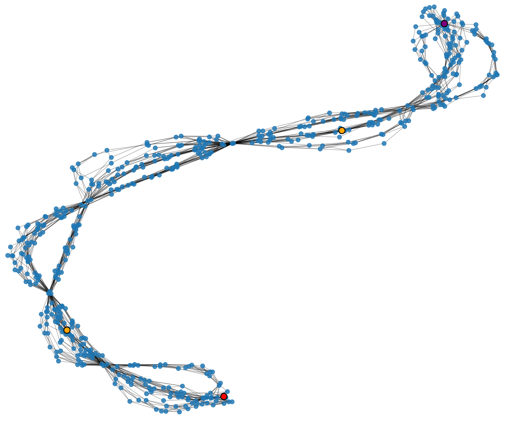

# Day 11: Reactor

[Problem Link](https://adventofcode.com/2025/day/11)

## Directed Graphs

It's important to recognize that the input is a **directed graph** meaning edges have a direction. In other words if edge `a --> b` exists, it does not mean that `b --> a` exists.

## Part 1

The device input provided is effectively a graph specified as an adjacency list. The problem asks us to find all paths from one node in the graph to another. This can be efficiently sovled using [Depth-First Search](https://www.geeksforgeeks.org/dsa/depth-first-search-or-dfs-for-a-graph/) + backtracking.

Due to the complexity of part 2, the part 1 solution was generalized into a `Graph` class found in `graph.py`, specifically the `Graph.all_paths()` method.

## Part 2 

### Naive DFS is too Slow

Part 2 asks us to find all paths containing some set of intermediary nodes (all of them in any order). After solving the problem, I can confidently say that the approach of just getting all paths and then filtering afterwards doesn't work.

### Visualizing the Graph

I was stuck on this problem for a while. I convinced myself that there was no meaningful improvement to the brute force approach of part 1 if the graph was truly random. Therefore, there must be some type of structure to the graph that we need to exploit.

I wrote some code in `visualize_graph.py` to visualize the graph, shown below



The red and purple nodes are `svr` and `out` (start and end nodes). The orange nodes are `ftt` and `dac` (the intermediary nodes we need to hit).

There are almost these ribbons formed, which is likely due to how this graph was algorithmically generated. After a while I had an epiphany, maybe the graph is a [DAG](https://en.wikipedia.org/wiki/Directed_acyclic_graph)?


### The Graph is a DAG!

You can prove that a graph is a DAG by checking if it can be [topologically sorted](https://en.wikipedia.org/wiki/Topological_sorting). In `graph.py`, I wrote `Graph.topological_sort()` and it turns out that it could!

Now that I know the graph is a DAG I can do two things. First, I can write a more efficient DFS to find all paths between two nodes utilizing dynamic programming; see the differences between `Graph.all_paths()` and `Graph.all_paths_dag()`. Second (and more importantly), we can use the topological order to our advantage.

In this problem, the topological order of the input devices are

```
svr --> fft --> dac --> out
```

Therefore, instead of calling `all_paths_dag("svr", "out")`, which is way too slow, I can break it up into
```
svr_fft_paths = all_paths_dag("svr", "fft")
fft_dac_paths = all_paths_dag("fft", "dac")
dac_out_paths = all_paths_dag("dac", "out")
```

Then the total number of paths from `svr` to `out` is
```
num_paths = len(svr_fft_paths) * len(fft_dac_paths) * len(dac_out_paths)
```

A very nice and clever solution. So far this is my favorite problem.
